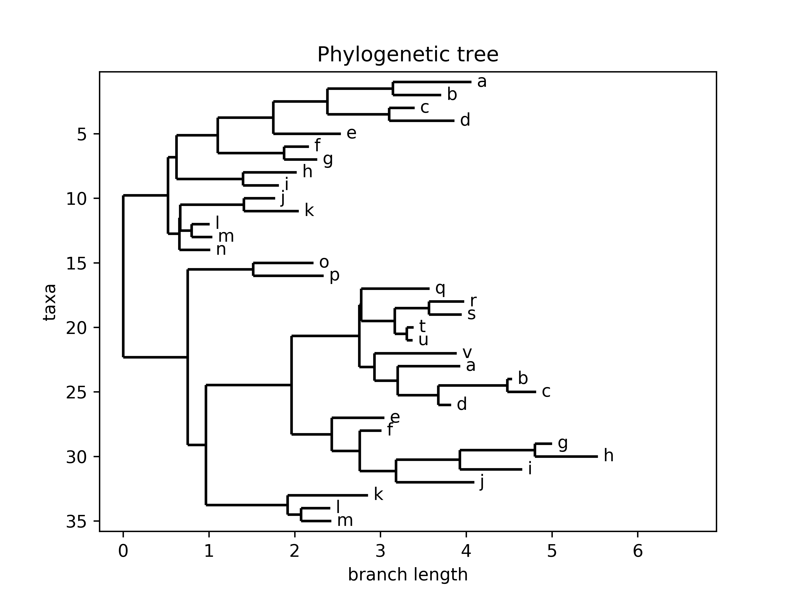

# PhylogeneticTrees
Phylogenetic trees: Newick to .png converter. Student project 2017/2018.

## 1. Introduction
Main aim of the project was to create Newick format to .png converter. It was achieved in many ways - the user can paste the text to the console, read it from the file or even generate random phylogenetic tree. There are few options of tree's visualisation: it can either be displayed as Matplotlib image, saved in the folder or displayed in the console using PhyloTree library. 

## 2. System requirements
Working Python 3 interpreter. The project uses following libraries: Bio, numpy, ete3, optparse, random, matplotlib. 

## 3. Project structure
### 3.1. Implementation part
Implementation part is situated in <i> implementation </i> folder. It consists of the following classes:
- Main.py - Initializer of the project. It provides as well Option Parser, which allows to run project with arguments from the console, as interactive menu. Firstly user has to choose one of the following possibilities: <b><i> file </b></i> for running file mode (available only for .xml files), <b><i> console </b></i> for running from the console, <b><i> r </b></i> for initializing RandomTree class, <b><i> help </b></i> for help and <b><i> q </b></i> for terminating the program. 

  In the <i> file </i> case, user is asked to provide a path with name of the file (or only name if the file is in implementation folder). Then he has to choose if he wants to save file ('s') or only to display it. The FileParser class is initialized.
  
  While choosing <i> console </i> option, program needs mode specification: by pressing 'p' there will be primitive variant selected, 's' for default visualisation but only saving; in any other case there will be default mode run. Then it's time for newick format (ending by semicolon) provided. The Parser object is created.
  
  When pressing 'r', the user has only to choose between saving and displaying mode. Then there is RandomTree class started. 
  
  Main.py runs again and again until pressing 'q'.
- Parser.py - class which contains two functions besides the __init__ definition. The constructor has three arguments: self, newick (text pasted previously to the console) and option (primitive/saving/default). First there is format correction checked; if it is ok, next steps depend on the chosen mode: for 'p' it uses PhyloTree (from ete3) and draws primitive phylogenetic trees; in 's' case user is asked for naming the figure which has to be created, then 'parse' function starts; in other cases there is also 'parse' function run but without name argument. 

    <i> check_correction(self, newick) </i> function checks if there is semicolon at the end of the text. It also supervises brackets correction.
    
    <i> parse(self, list_of_nodes, option, title="tree") </i> creates temporary file where the newick format is pasted. This operation was inevitable due to problems with Phylo functions in Python 3. The text is read, then Phylol function <i> draw </i> is initialized and temporary file is closed and deleted.
- FileParser.py - class which has slightly different initial parameters: self, location and option. This <i> check_correction </i> function reads text from provided location and checks if it meets the requirements. If 's' options is chosen, the program saves the image with the .png extension and name same as in the .xml file. In other case it displays the image.
- Phylol.py (abbreviation for Phylo light) - as it is mentioned in the file, <b> I do not own full rights to this part of code </b>. It is <u> slightly edited </u> <i> draw </i> function from Phylo library. Why? There was no sense to reinvent the wheel while drawing the tree but I thought that it would be good to somehow improve it. I added <i> title </i> argument, which sets figure name while displaying. There is also 'Phylogenetic tree' title (but its only for aesthetic purposes). Main action takes place in the end: if running the display mode, foremost there is figure manager created and the window maximalized (it really makes difference when there are trees with 80 nodes provided). In saving mode there is title set and figure saved (originally when do_show flag was false, the function had no effect).
- RandomTree.py - the most complicated class (or at least the class which required most of the time while creating the project). It generates random tree in newick format. Besides __init__ it contains one decorator and two functions. Initializing function needs two arguments: self and option chosen in Main.py. Thanks to numpy functionality it randomly chooses number of nodes in the tree (integer between 4 and 79) and creates a list. Then it gives every node a distance (branch length) and a letter. It appends the (letter: distance) node to the list. When done, it uses split_list function, converts the list into string and changes every type of brackets into one. Split_list creates dichotomous branches by dividing recursively the list. When the newick format is almost ready, the program adds lengths to newly created branches. Every branch length is random between (0, 1). In the end list of nodes and chosen in Main.py option is passed to Parser.

## 3.2. Testing part
Testing part consists of ParserUnitTests.py file which tests main functionality of the program. There are four types of tests:
- primitive parser - it gives to the Parser text in newick format and checks if the output is as it should be
- wrong values - it gives to the Parser wrong formatted text and checks if check_correction function throws correct information
- draw and display - checks if while drawing there is no output which would be a cause of wrong format
- draw and save - checks if there is new png file generated (with default name tree.png)

# 4. Random tree example

This tree is generated by RandomTree class. 
